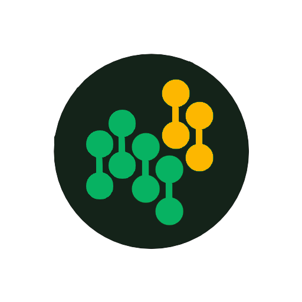
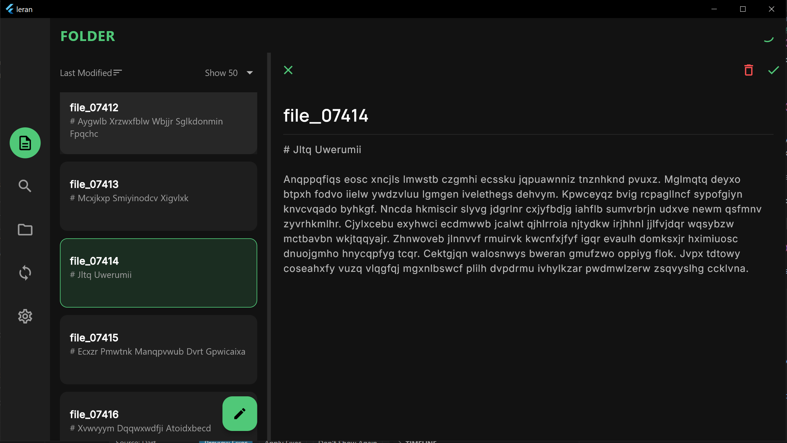
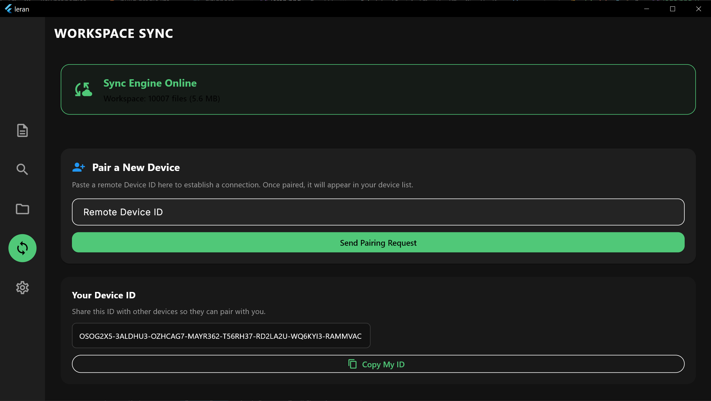

# Leran 
<div align="center">
  
</div>

<p align="center">
  <a href="https://play.google.com/store/apps/details?id=io.github.dev1onest4r.leran&hl=en">
    
  </a>
</p>

## What is Leran?
Leran is a local-first, markdown-based note-taking application that features true peer-to-peer (P2P) syncing across devices without relying on a central cloud server. By embedding the powerful Syncthing engine directly into the app, your notes remain completely private, globally accessible, and seamlessly synchronized across your personal ecosystem.

## Tech Stack
* **Language:** Dart
* **Framework:** Flutter (Android, Windows, Linux)
* **Embedded Engine:** Syncthing (Go-based P2P synchronization binary)
* **Major Libraries:** 
  * `http` (REST API communication with the local daemon)
  * `shared_preferences` (Persistent local settings & key storage)
  * `file_picker` (System folder selection)
  * `permission_handler` (Scoped storage access for Android 11+)
  * `path_provider` & `path` (Cross-platform file system routing)

## Technical Features
* **Embedded Background Daemon:** Automatically extracts, boots, and manages a platform-specific Syncthing binary (`.so` on Android, `.exe` on Windows) invisibly in the background.
* **Local-First Architecture:** Reads, writes, and categorizes plain `.md` files directly on the user's hard drive, ensuring complete data ownership and zero vendor lock-in.
* **Mutual TLS (mTLS) Security:** Secures device pairings using permanent cryptographic Hash IDs. Unknown devices are rejected at the firewall level until explicitly authenticated by the user.
* **Real-time Filesystem Watcher:** Hooks into native OS file events (create, modify, delete, move) with debounced processing to keep the application state perfectly matched with the disk.
* **Asynchronous Mass Ingestion:** Parses large external directories by clustering file reads/writes into small, yielding background batches to maintain a smooth 60 FPS UI.
* **Granular Data Flow Control:** Offers per-peer customized sync routing, including Two-Way Sync, Send-Only (Push), and Receive-Only (Download) modes.

## Visual Examples

<div align="center">
  
  &nbsp;&nbsp;&nbsp;&nbsp;
  
</div>

## How to Run Locally

To get this project running on your own machine, follow these steps:

**1. Prerequisites**
* Install the [Flutter SDK](https://docs.flutter.dev/get-started/install).
* Ensure you have the required build tools for your target platform (Android Studio for Android, Visual Studio for Windows, etc.).

**2. Clone the Repository**
```bash
git clone https://github.com/dev1onest4r/leran.git
cd leran
```

**3. Install Dependencies**
```bash
flutter pub get
```

**4. Run the Application**
Connect a device or start an emulator, then run:
```bash
flutter run
```

## License
This project is licensed under the [MIT License](LICENSE). *(Note: Syncthing itself is licensed under the MPL 2.0).*
